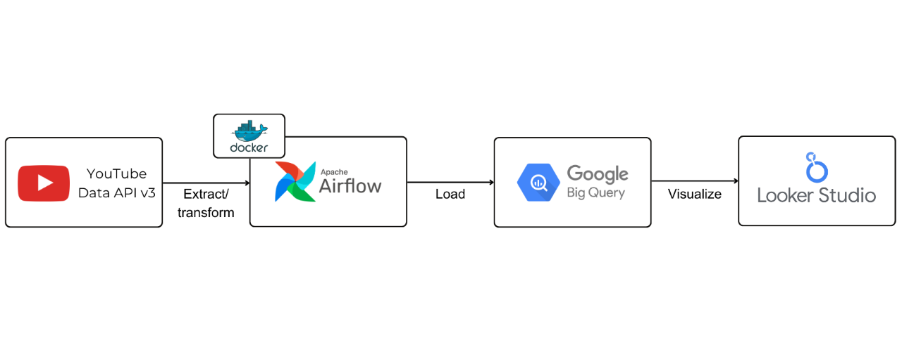

# airflow_youtube_project

In this project, we will set up a daily workflow, using Apache Airflow to retrieve trending videos data from YouTube Data API v3 and store them in BigQuery. We'll also utilize Looker Studio to create an interactive dashboard, enabling us to stay updated with the latest trends on YouTube and gain valuable insights from the collected data.

You can find a comprehensive guide of this project in the following article: [Using Airflow And YouTube API To Automatically Retrieve Trending Videos](https://supertype.ai/notes/airflow-trending-youtube-video-project/)
