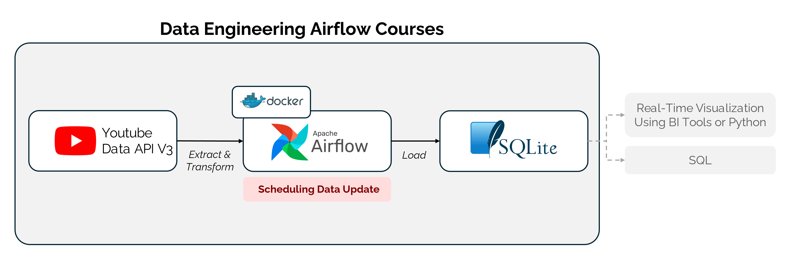
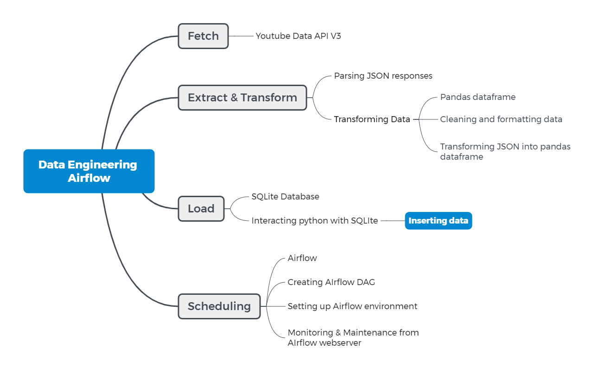

# Data Engineering using Airflow

## 🗃️ Overview: Scheduling Fetch and Store Youtube Data APIV3 w/ Airflow



This project aims to set up a daily workflow using Apache Airflow to retrieve trending videos data from the YouTube Data API v3 and store it in MySQL. 

### Course Mindmap



### Key Features:
- **Data Retrieval:** Fetches trending videos data from the YouTube Data API v3.
- **Data Preprocessing:** Preprocesses the fetched data to extract relevant information.
- **Data Storage:** Stores the preprocessed data in MySQL for further analysis and usage.
- **Automation:** Set up DAGs (Directed Acyclic Graphs) in Apache Airflow to automate the data retrieval and storage process.

### Technologies Used:
- **Apache Airflow:** Workflow management system for orchestrating data pipelines.
- **YouTube Data API v3:** API for accessing and retrieving YouTube data.
- **Python:** Programming language used for scripting and data manipulation.
- **SQLite:** Relational database management system for storing the retrieved data.

### Directory Contents

```
📝 articles

📚 coursebooks
├──📁 dags
    ├──📄 .env 
        Environment file containing YOUTUBE_API_KEY
    ├──📄 service_account_key.json 
        Service account key file for YouTube API
    ├──📄 categories.json 
        JSON file containing YouTube video categories
    ├──📄 tmp_file.json 
        Temporary JSON file
    ├──📄 tmp_file_processed.json 
        Processed JSON file
    ├──📚 **trending_youtube_dag_sqlite.py** 
        DAG definition for processing trending YouTube data
├──📁 db 
    Directory for Airflow database
├──📁 logs 
    Directory for Airflow logs
├──📁 plugins 
    Directory for Airflow plugins
├──📄 .env 
    Environment file containing AIRFLOW_UID=50000
├──📚 **01_fetch_data_api.ipynb**
├──📚 **02_airflow_introduction.ipynb**
├──📚 **03_connect_db_to_airflow.ipynb**
├──📚 **04_generate_and_run_script.ipynb**
├──📄 docker-compose.yaml 
    Docker Compose file for defining Airflow services
├──📄 Dockerfile 
    Dockerfile for customizing Airflow image, if needed for install requirements.txt
├──📄 requirements.txt 
    Python dependencies for the project
```

Stay tuned for updates as we progress with the development and deployment of this data pipeline!
